# Title
### 대한민국 아파트 실거래 데이터셋을 활용한 가격 예측을 통한 지역별 아파트 매입 추천

# Member
- 이강훈 Kanghun Lee
- 우동훈 DongHun Woo
- 강종석 JongSeok Kang

# 1. Objective
- 대한민국 아파트 실거래 데이터셋을 머신러닝을 이용하여 학습시키고 매매 투자시 가장 큰 이익을 가져다 주는 아파트를 예측

# 2. Dataset
- 아파트 실거래가 데이터 01/15/2015 ~ 04/30/2023 (Kaggle)
- 국가지역코드 (공공데이터)
- 행정구역 별 인구수 (KOSIS)
- 행정구역 별 실업률 (KOSIS)
- 시도 별 1인당 개인소득득(KOSIS)
- 소비자물가지수(ECOS)
- 예금은행 지역별 가계대출(말잔) (ECOS)
- 한국은행 기준금리 (ECOS)

# 3. Data PreProcessing
- Environment
    - python 3.11
    - pip install pandas matplotlib glob PIL

- Source Code
    - APTDealData_PreProcessing.py

- 'KoreaApartDeal.csv' Data는 지역코드와 법정동 Data만 존재하여, 시도명 및 시군구명 공공데이터 'LocationCode.csv' 를 이용하여 Human Readable Data 로 변경
- 지역명과 아파트, 전용면적으로 UniqueID로 고유값을 생성하여 Data Processing 및 시각화에 용의하도록 개선
  
[ Kaggle 원본 데이터 : 시도 이름 없어 데이터 분류 어려움 ]
| 지역코드 | 법정동 | 거래일 | 아파트 | 지번 | 전용면적 | 층 | 건축년도 | 거래금액 |
| --- | --- | --- | --- | --- | --- | --- | --- | --- |
| 31110 | 학성동 | 5/30/2020 0:00 | 남운학성타운 | 379 | 135.58 | 8 | 1991 | 26700 |
| 31110 | 남외동 | 1/3/2020 0:00 | 남외푸르지오1차 | 506-1 | 101.6 | 2 | 2006 | 35500 |

[ 지역코드 공공데이터와 merge하여 시도 및 시군구명 추가 ]
| UniqueID | 시도명 | 시군구명 | 법정동 | 아파트 | 전용면적 | 거래일 | 거래금액 |
| --- | --- | --- | --- | --- | --- | --- | --- |
| 311101010000000136 | 울산광역시 | 중구 | 학성동 | 남운학성타운 | 135.58 | 2020-05-30 | 26700 |
| 311101150000001102 | 울산광역시 | 중구 | 남외동 | 남외푸르지오1차 | 101.6 | 2020-01-03 | 35500 |

```python
location_df_filtered = location_df[location_df['시군구명'].notna()].copy()
location_df_filtered['지역코드'] = location_df_filtered['법정동코드'].str[:5].astype(int)
loc_map = location_df_filtered[['지역코드', '시도명', '시군구명']].drop_duplicates()
df = pd.merge(deal_df, loc_map, on='지역코드', how='left')

loc_lookup = location_df[['시도명', '시군구명', '읍면동명', '리명', '법정동코드']].copy()
loc_lookup['법정동'] = (loc_lookup['읍면동명'].fillna('') + ' ' + loc_lookup['리명'].fillna('')).str.strip()
final_df = pd.merge(df, loc_lookup[['시도명', '시군구명', '법정동', '법정동코드']],
                    on=['시도명', '시군구명', '법정동'],
                    how='left')

unique_apart_count = final_df['아파트'].nunique()
final_df['아파트ID'] = pd.factorize(final_df['아파트'])[0]
final_df['아파트ID'] = final_df['아파트ID'].astype(str).str.zfill(5)
final_df['전용면적ID'] = final_df['전용면적'].round(0).astype(int).astype(str).str.zfill(3)
final_df['UniqueID'] = final_df['법정동코드'] + final_df['아파트ID'] + final_df['전용면적ID']
```


- Kaggle Data중 '거래일자'의 Date Format이 불규칙하여, 하나의 format으로 변경하여 data frame에 저장
- Kaggle Data중 '거래금액'의 Foramt이 불규칙하여, numeric으로 변경 할 수 있도록 string 변환

[ format 이 일정치 않는 거래일과 거래금액 ]
| UniqueID | 시도명 | 시군구명 | 법정동 | 아파트 | 전용면적 | 거래일 | 거래금액 |
| --- | --- | --- | --- | --- | --- | --- | --- |
| 311101010000000136 | 울산광역시 | 중구 | 학성동 | 남운학성타운 | 135.58 | 5/30/2020 0:00 | 26700 |
| 263801060021603049 | 부산광역시 | 사하구 | 다대동 | 몰운대 | 49.08 | 2016-01-07 00:00:00 | 10600 | 
| 431121090007429085 | 충청북도 | 청주시서원구 | 개신동 | 삼익2 | 84.96 | 2022-11-27 00:00:00 | 16,500 |


[ 표준 format으로 변경 및 결측 데이터 삭제]
| UniqueID | 시도명 | 시군구명 | 법정동 | 아파트 | 전용면적 | 거래일 | 거래금액 |
| --- | --- | --- | --- | --- | --- | --- | --- |
| 311101010000000136 | 울산광역시 | 중구 | 학성동 | 남운학성타운 | 135.58 | 2020-05-30 | 26700 |
| 263801060021603049 | 부산광역시 | 사하구 | 다대동 | 몰운대 | 49.08 | 2018-03-01 | 10600 | 
| 431121090007429085 | 충청북도 | 청주시서원구 | 개신동 | 삼익2 | 84.96 | 2022-11-27 | 16500 |


```python
final_df['거래금액'] = pd.to_numeric(final_df['거래금액'].astype(str).str.replace(',', ''), errors='coerce')
final_df['거래일_정리'] = final_df['거래일'].astype(str).str.split(' ').str[0]
final_df['거래일_정리'] = pd.to_datetime(final_df['거래일_정리'], format='mixed', errors='coerce')
invalid_dates = final_df[final_df['거래일_정리'].isnull()]
final_df.dropna(subset=['거래일_정리'], inplace=True)
final_df['거래일'] = final_df['거래일_정리'].dt.date
final_df.drop(columns=['거래일_정리'], inplace=True)
```

- 아파트 매매 가격 변동에 영향을 줄 수 있는 인자 Data 들과 아파트 실거래가 Data를 시계열로 merge
    - 행정구역 별 인구수
    - 행정구역 별 실업률
    - 시도 별 1인당 개인소득
    - 소비자물가지수
    - 예금은행 지역별 가계대출
    - 한국은행 기준금리

[ merged 된 최종 preprocessed data ]
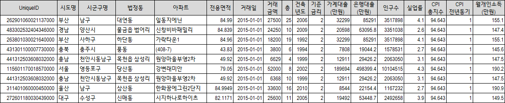


```python
    # 기준금리 합치기
    apt_price_df = pd.merge_asof(
        apt_price_df.sort_values("거래일"),
        rate_df.sort_values("날짜"),
        left_on="거래일",
        right_on="날짜",
        direction="forward",
    ).drop(columns=["날짜"])

    apt_price_df["월기준"] = apt_price_df["거래일"].values.astype("datetime64[M]")

    # 가계대출금 합치기
    loan_long = std_household_loan_df.melt(
        id_vars=["날짜"],
        var_name="시도명",
        value_name="가계대출(만원)",
    )
    apt_price_df = pd.merge(
        apt_price_df,
        loan_long,
        left_on=["월기준", "시도명"],
        right_on=["날짜", "시도명"],
        how="left",
    ).drop(columns=["날짜"])


    # 은행대출금 합치기
    loan_long = std_bank_loan_df.melt(
        id_vars=["날짜"],
        var_name="시도명",
        value_name="은행대출(만원)",
    )
    apt_price_df = pd.merge(
        apt_price_df,
        loan_long,
        left_on=["월기준", "시도명"],
        right_on=["날짜", "시도명"],
        how="left",
    ).drop(columns=["날짜"])

    # 인구수 합치기
    pop_long = std_population_df.melt(
        id_vars=["날짜"],
        var_name="시도명",
        value_name="인구수",
    )
    apt_price_df = pd.merge(
        apt_price_df,
        pop_long,
        left_on=["월기준", "시도명"],
        right_on=["날짜", "시도명"],
        how="left",
    ).drop(columns=["날짜"])

    # 실업률 합치기
    unemp_long = std_unemployment_df.melt(
        id_vars=["날짜"],
        var_name="시도명",
        value_name="실업률",
    )
    apt_price_df = pd.merge(
        apt_price_df,
        unemp_long,
        left_on=["월기준", "시도명"],
        right_on=["날짜", "시도명"],
        how="left",
    ).drop(columns=["날짜"])
    print("실업률 합치기 end")

    # CPI (소비자물가지수) 합치기
    cpi_df["월기준"] = cpi_df["날짜"].values.astype("datetime64[M]")
    apt_price_df = pd.merge(
        apt_price_df,
        cpi_df,
        on="월기준",
        how="left",
    ).drop(columns=["날짜"])

    # 개인소득 합치기
    income_long = std_income_df.melt(
        id_vars=["날짜"],
        var_name="시도명",
        value_name="월개인소득(만원)",
    )
    apt_price_df = pd.merge(
        apt_price_df,
        income_long,
        left_on=["월기준", "시도명"],
        right_on=["날짜", "시도명"],
        how="left",
    ).drop(columns=["날짜"])

```

# 4. Data Visialization
- Environment
    - python 3.11
    - pip install pandas matplotlib glob PIL

- Source Code
    - APTDealData_PreProcessing.py

- 년도별 거래량 추이
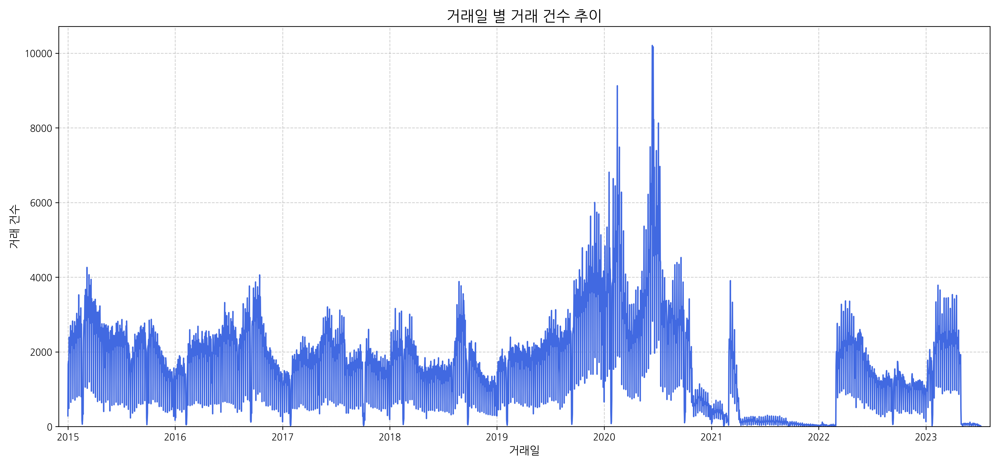

```python
def save_transaction_plots_by_date(df, output_dir='preprocessed'):
    os.makedirs(output_dir, exist_ok=True)
    print("\n--- Starting to extract daily transaction counts ---")
    daily_transaction_counts = final_df['거래일'].value_counts()
    daily_transaction_counts_sorted = daily_transaction_counts.sort_index()

    plt.figure(figsize=(15, 7))
    daily_transaction_counts_sorted.plot(kind='line', color='royalblue')
    plt.title('거래일 별 거래 건수 추이', fontsize=16)
    plt.xlabel('거래일', fontsize=12)
    plt.ylabel('거래 건수', fontsize=12)
    plt.margins(x=0.01)
    plt.ylim(bottom=0)
    plt.grid(True, linestyle='--', alpha=0.6)
    plt.tight_layout()

    output_viz_path = os.path.join(output_dir, '거래일별_거래건수_추이.png')
    plt.savefig(output_viz_path, dpi=300)
    print(f"Trend chart has been saved to: '{output_viz_path}'")

    plt.close()
```

- 17개 광역시도 별 거래량 Top 100의 년도별 가격 추이
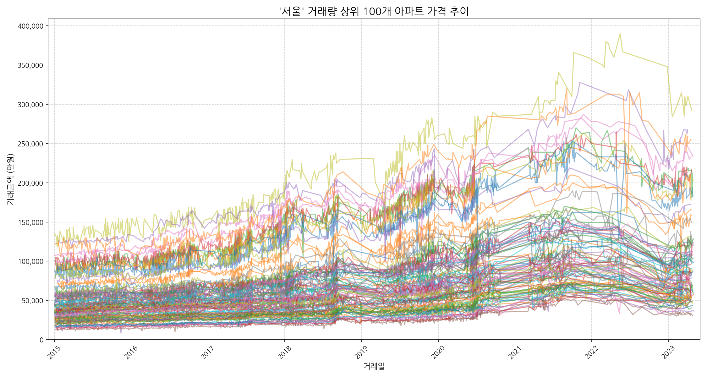


- 17개 광역시도 별 거래량 Top 100의 년도별 가격 추이
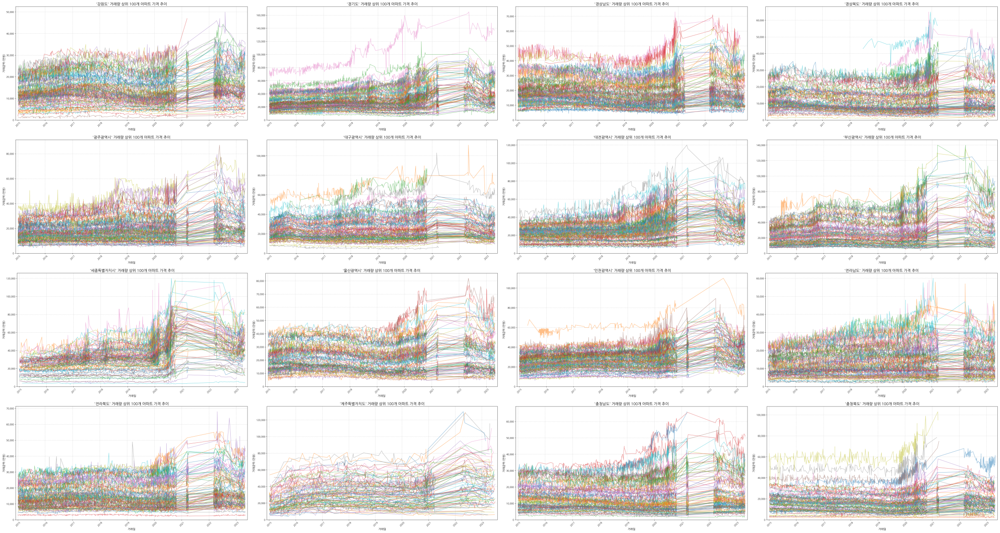

```python
def save_top100_plots_by_sido(df, output_dir='preprocessed'):
    os.makedirs(output_dir, exist_ok=True)
    print(f"transcation top 100 chart images are saved in '{output_dir}' folder.")

    sido_list = df['시도명'].unique()

    for sido in sido_list:
        print(f"\n'{sido}' chart is saving...")

        sido_df = df[df['시도명'] == sido].copy()

        if sido_df.empty:
            print(f"'{sido}' is empty. Skip!")
            continue

        transaction_counts = sido_df['UniqueID'].value_counts()
        top_100_ids = transaction_counts.head(100).index
        top_100_df = sido_df[sido_df['UniqueID'].isin(top_100_ids)]

        print(f"Graphing the top 100 apartment transactions out of a total of {len(transaction_counts):,} in the '{sido}' region.")

        plt.figure(figsize=(15, 8))
        ax = plt.gca()

        for unique_id in top_100_ids:
            target_df = top_100_df[top_100_df['UniqueID'] == unique_id].copy()
            if not target_df.empty:
                target_df.sort_values('거래일', inplace=True)
                ax.plot(target_df['거래일'], target_df['거래금액'], marker='', linestyle='-', alpha=0.5)

        plt.title(f"'{sido}' 거래량 상위 100개 아파트 가격 추이", fontsize=16)
        plt.xlabel("거래일", fontsize=12)
        plt.ylabel("거래금액 (만원)", fontsize=12)
        plt.ylim(bottom=0)
        ax.yaxis.set_major_formatter(mticker.FuncFormatter(lambda x, p: format(int(x), ',')))
        plt.margins(x=0.01)
        plt.xticks(rotation=45)
        plt.grid(True, linestyle='--', alpha=0.6)
        plt.tight_layout()

        safe_sido_name = "".join(c for c in sido if c.isalnum())
        filename = f"{safe_sido_name}_가격추이_상위100.png"
        filepath = os.path.join(output_dir, filename)

        plt.savefig(filepath, dpi=300)
        print(f"'{filepath}' file saved.")

        plt.close()
```

- 행정구역 별 인구수 추이


- 행정구역 별 실업률 추이
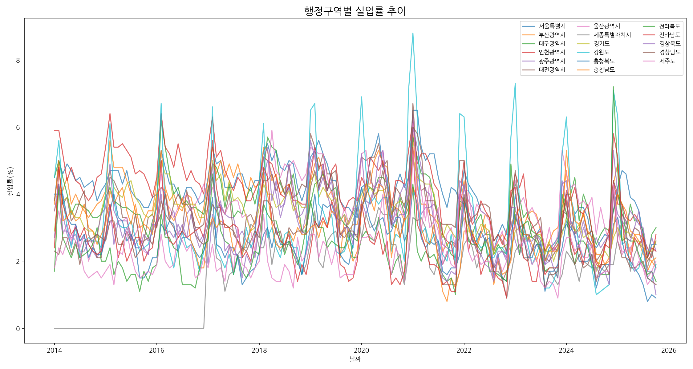

- 소비자물가지수 추이
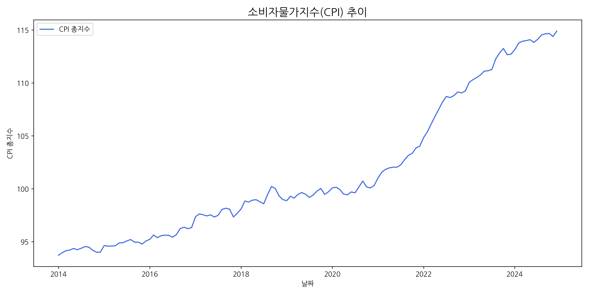

- 예금은행 지역별 가계대출 추이
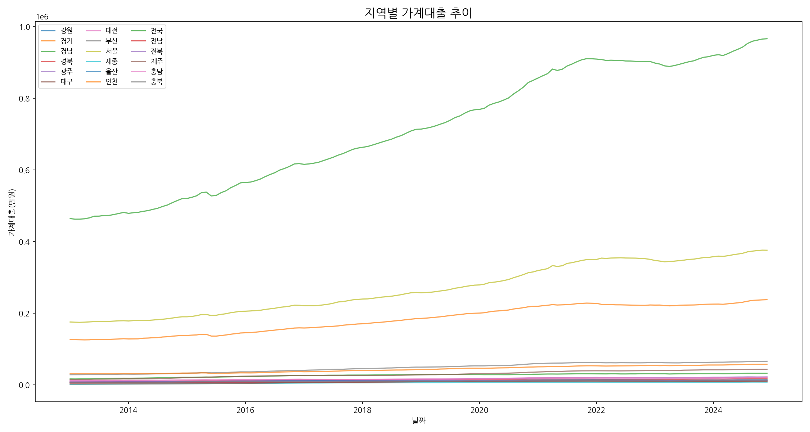

- 예금은행 지역별 은행대출 추이
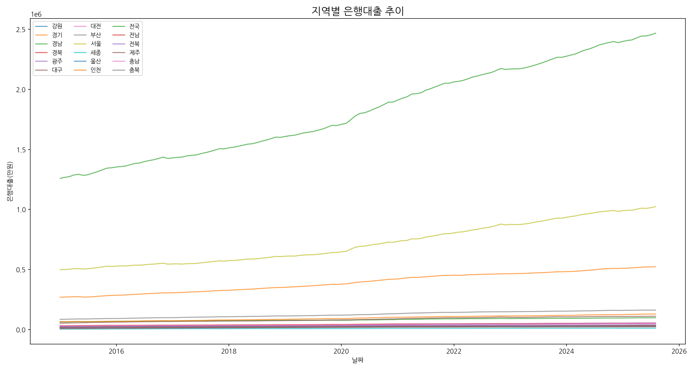

- 한국은행 기준금리 추이
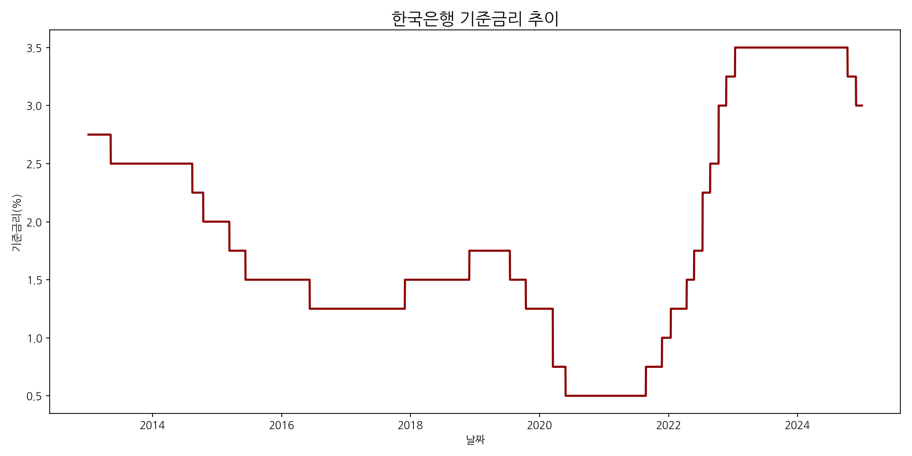

```python
def plot_macro_trends(pop_df, unemp_df, cpi_df, household_df, bank_df, rate_df, output_dir='preprocessed'):

    # 1. 행정구역별 인구수 추이
    plt.figure(figsize=(15, 8))
    for col in pop_df.columns[1:]:
        plt.plot(pop_df['날짜'], pop_df[col], label=col, alpha=0.7)
    plt.title('행정구역별 인구수 추이', fontsize=16)
    plt.xlabel('날짜')
    plt.ylabel('인구수')
    plt.legend(ncol=3, fontsize=9)
    plt.tight_layout()
    plt.savefig(os.path.join(output_dir, '행정구역별_인구수_추이.png'), dpi=150)
    plt.close()

    # 2. 행정구역별 실업률 추이
    plt.figure(figsize=(15, 8))
    for col in unemp_df.columns[1:]:
        plt.plot(unemp_df['날짜'], unemp_df[col], label=col, alpha=0.7)
    plt.title('행정구역별 실업률 추이', fontsize=16)
    plt.xlabel('날짜')
    plt.ylabel('실업률(%)')
    plt.legend(ncol=3, fontsize=9)
    plt.tight_layout()
    plt.savefig(os.path.join(output_dir, '행정구역별_실업률_추이.png'), dpi=150)
    plt.close()

    # 3. 소비자물가지수(CPI) 추이
    plt.figure(figsize=(12, 6))
    plt.plot(cpi_df['날짜'], cpi_df['CPI_총지수'], color='royalblue', label='CPI 총지수')
    plt.title('소비자물가지수(CPI) 추이', fontsize=16)
    plt.xlabel('날짜')
    plt.ylabel('CPI 총지수')
    plt.legend()
    plt.tight_layout()
    plt.savefig(os.path.join(output_dir, '소비자물가지수_추이.png'), dpi=150)
    plt.close()

    # 4. 지역별 가계대출 추이
    plt.figure(figsize=(15, 8))
    for col in household_df.columns[1:]:
        plt.plot(household_df['날짜'], household_df[col], label=col, alpha=0.7)
    plt.title('지역별 가계대출 추이', fontsize=16)
    plt.xlabel('날짜')
    plt.ylabel('가계대출(만원)')
    plt.legend(ncol=3, fontsize=9)
    plt.tight_layout()
    plt.savefig(os.path.join(output_dir, '지역별_가계대출_추이.png'), dpi=150)
    plt.close()

    # 5. 지역별 은행대출 추이
    plt.figure(figsize=(15, 8))
    for col in bank_df.columns[1:]:
        plt.plot(bank_df['날짜'], bank_df[col], label=col, alpha=0.7)
    plt.title('지역별 은행대출 추이', fontsize=16)
    plt.xlabel('날짜')
    plt.ylabel('은행대출(만원)')
    plt.legend(ncol=3, fontsize=9)
    plt.tight_layout()
    plt.savefig(os.path.join(output_dir, '지역별_은행대출_추이.png'), dpi=150)
    plt.close()

    # 6. 한국은행 기준금리 추이
    plt.figure(figsize=(12, 6))
    plt.plot(rate_df['날짜'], rate_df['기준금리'], color='darkred', linewidth=2)
    plt.title('한국은행 기준금리 추이', fontsize=16)
    plt.xlabel('날짜')
    plt.ylabel('기준금리(%)')
    plt.tight_layout()
    plt.savefig(os.path.join(output_dir, '한국은행_기준금리_추이.png'), dpi=150)
    plt.close()

```

# 5. Analysis based on Theory
- XGBoost Algorithm


> XGBoost란?
>> XGBoost(eXtreme Gradient Boosting)는 경사하강법을 활용하는 지도 학습 부스팅 알고리즘인 그레이디언트 부스트 Decision Trees를 사용하는 분산형 오픈 소스 머신 러닝 라이브러리입니다. 속도, 효율성, 대규모 데이터 세트에 대한 확장성이 뛰어난 것으로 잘 알려져 있음
>> 워싱턴 대학교의 티안치 첸(Tianqi Chen)이 개발한 XGBoost는 동일한 일반 프레임워크를 사용하여 그레이디언트 부스팅을 고급으로 구현한 것입니다. 즉, 잔차를 더하여 약한 학습기 트리를 강한 학습기로 결합

> Decision Trees와 부스팅 비교
>> - Decision Trees는 머신 러닝에서 분류 또는 회귀 작업에 사용
>> - 내부 노드는 기능을, 분기는 의사 결정 규칙을, 각 리프 노드는 데이터 세트의 결과를 나타내는 계층적 트리 구조를 사용
>> - Decision Trees는 과적합되기 쉽기 때문에 부스팅과 같은 앙상블 방법을 사용하여 더 견고한 모델을 만들 수 있음
>> - 부스팅은 여러 개의 개별 약한 트리, 즉 무작위 확률보다 약간 더 나은 성능을 보이는 모델을 결합하여 강한 학습기를 형성
>> - 각 약한 학습기는 이전 모델에서 발생한 오류를 수정하기 위해 순차적으로 학습.
>> - 수백 번의 반복 후 약한 학습기는 강한 학습기로 변환
>> - 랜덤 포레스트와 부스팅 알고리즘은 모두 개별 학습기 트리를 사용하여 예측 성능을 향상하는 인기 있는 앙상블 학습 기법
>> - 랜덤 포레스트는 배깅(부트스트랩 집계) 개념을 기반으로 하며 각 트리를 독립적으로 학습시켜 예측을 결합하지만, 부스팅 알고리즘은 약한 학습기가 순차적으로 학습되어 이전 모델의 실수를 수정하는 가산적 접근 방식을 사용

> XGBoost의 장점
>> - 높은 성능 (실제로 Kaggle에서 XGboost가 상위권을 다수 차지)
>> - 효율성, 유연성 ,휴대성이 뛰어남
>> - 여러 파라미터를 조절해 가며 최적의 Model을 만들 수 있음
>> - 과적합 방지
>> - 신경망에 비해 시각화가 쉽고, 직관적임
>> - 자원이 많으면 더 빠르게 학습시킬 수 있음
>> - Cross Validation 지원

> 시계열인 아파트 매매 가격 예측이 XGBoost를 사용한 이유
>> - 비선형 관계를 잘 포착함: 아파트 가격은 위치, 면적, 층수, 주변 인프라 등 다양한 요인에 의해 복잡하게 결정되는데, XGBoost는 트리 기반 모델로 이러한 비선형 관계를 효과적으로 학습할 수 있음
>> - 과적합 방지 기능: 정규화(regularization) 항을 포함하고 있어 모델이 훈련 데이터에 과도하게 맞춰지는 것을 방지
>> - 결측치 처리에 강함: 결측값이 있는 데이터에서도 자동으로 최적의 방향을 찾아 분기하기 때문에 전처리 부담 감소
>> - 학습 속도와 성능의 균형: 병렬 처리와 최적화된 알고리즘 덕분에 빠른 학습 속도와 높은 예측 성능을 동시에 제공
>> - 특성 중요도 해석 가능: 각 변수의 중요도를 계산할 수 있어, 어떤 요인이 가격에 영향을 미치는지 분석하기 용이

- Environment
    - python 3.11
    - pip install pandas numpy scikit-learn xgboost joblib matplotlib seaborn pillow

- Source Code
    - APTDealData_Train_Predict.py


- Data Load

 PreProcessed Data를 Load 하고, 거래 횟수가 너무 적은 아파트의 Data는 Train시 부정확성을 높일 우려가 있어, 사전 제거
```python
MIN_TRANSACTION_COUNT = 50  # 최소 거래 횟수 필터링 기준
apt_counts = df['UniqueID'].value_counts()
valid_uids = apt_counts[apt_counts >= MIN_TRANSACTION_COUNT].index
df = df[df['UniqueID'].isin(valid_uids)].copy()
```

- XGBoost 입력 전 시도명 등 String 형식의 Data를 LabelEncoder를 통하여 정수형으로 변경
```python
cat_features = ['시도명', '시군구명', '법정동', '아파트']
label_encoders = {}
for col in cat_features:
    df[col] = df[col].astype(str).fillna('missing')
    le = LabelEncoder()
    df[col] = le.fit_transform(df[col])
    label_encoders[col] = le
```

- XGBoost 입력
```python
# 인코딩된 데이터를 X에 할당
X = df[features]
y = df[target]

features = ['시도명', '시군구명', '법정동', '아파트', '전용면적', '건축년도', '거래_년', '거래_월', '건축_경과년수', '최근_거래일_점수', '기준금리', '가계대출(만원)', '인구수', '실업률', 'CPI_총지수', 'CPI_전년동기', '월개인소득(만원)']    
target = '거래금액'
X_train, X_test, y_train, y_test = train_test_split(X, y, test_size=0.2, random_state=42)
xgb_model = XGBRegressor(
    n_estimators=1000,
    learning_rate=0.3,
    max_depth=6,
    random_state=42,
    n_jobs=-1
)
xgb_model.fit(X_train, y_train)
```

- XGBoost용 preload data 및 trained data를 file로 저장하여, 매번 load를 하지않고 prediction시 Quick하게 수행
```python
if not SHOULD_RETRAIN:
    # XGBoost용 preload data 및 trained data file을 읽기
    dtype_spec_loaded = {col: 'int' for col in ['시도명', '시군구명', '법정동', '아파트']}
    df = pd.read_csv(PRELOAD_FILE_PATH, dtype=dtype_spec_loaded)
    xgb_model = joblib.load(MODEL_FILE_PATH)

# Snip... XBoost 수행 ...

# XGBoost용 preload data 및 trained data를 file로 저장하여
df.to_csv(PRELOAD_FILE_PATH, index=False, encoding='utf-8')
joblib.dump(xgb_model, MODEL_FILE_PATH)
```

# 6. Prediction
- Environment
    - python 3.11
    - pip install pandas numpy scikit-learn xgboost joblib matplotlib seaborn pillow

- Source Code
    - APTDealData_Train_Predict.py


- 매입 시점은 2026년 1월,  매각 시점은 2030년 1월로 고정
- 매입 시점 이후부터 매각시점까지 시계열 가격을 XGBoost 학습데이터로 Prediction

```python
def predict_region(df, selected_sido, xgb_model, features, cat_features, label_encoders, base_deal_date):

    encoded_sido = label_encoders['시도명'].transform([selected_sido])[0]

    region_df = df[df['시도명'] == encoded_sido].copy()

    all_unique_apts = region_df.drop_duplicates(subset=['UniqueID']).reset_index(drop=True)
    total = len(all_unique_apts)
    print(f"\n[{selected_sido}] 지역의 {total}개 고유 아파트에 대해 예측 데이터 생성 시작.")

    predict_date_buy = pd.to_datetime('2026-01-01')
    predict_date_sell = pd.to_datetime('2030-01-01')

    records = []

    for idx, apt in all_unique_apts.iterrows():
        apt_id = apt['UniqueID']
        past_df = region_df[region_df['UniqueID'] == apt_id].copy()
        if past_df.empty:
            continue

        # 진행상황 표시
        print(f"\r[ {idx + 1} / {total} ] 처리 중...", end='')

        base_row = past_df.sort_values(by='거래일', ascending=True).iloc[-1].copy()

        encoded_values = {
            'UniqueID': apt_id,
            '시도명': base_row['시도명'],
            '시군구명': base_row['시군구명'],
            '법정동': base_row['법정동'],
            '아파트': base_row['아파트'],
            '전용면적': base_row['전용면적'],
            '건축년도': base_row['건축년도'],
            '기준금리': base_row['기준금리'],
            '가계대출(만원)': base_row['가계대출(만원)'],
            '인구수': base_row['인구수'],
            '실업률': base_row['실업률'],
            'CPI_총지수': base_row['CPI_총지수'],
            'CPI_전년동기': base_row['CPI_전년동기'],
            '월개인소득(만원)': base_row['월개인소득(만원)'],
        }

        def make_feature_row(date):
            row = encoded_values.copy()
            row['거래_년'] = date.year
            row['거래_월'] = date.month
            row['건축_경과년수'] = date.year - base_row['건축년도']
            row['최근_거래일_점수'] = (date - base_deal_date).days
            return row

        buy_X = pd.DataFrame([make_feature_row(predict_date_buy)])[features]
        sell_X = pd.DataFrame([make_feature_row(predict_date_sell)])[features]

        buy_price = int(xgb_model.predict(buy_X)[0])
        sell_price = int(xgb_model.predict(sell_X)[0])

        record = encoded_values.copy()
        record['매입예상가_2026_01'] = buy_price
        record['매각예상가_2030_01'] = sell_price
        record['예상_최대이익'] = sell_price - buy_price
        records.append(record)

    print("\n모델 예측 완료. 결과 DataFrame 구성 중...")

    reco_df = pd.DataFrame(records)

    for col in cat_features:
        if col in reco_df.columns:
            reco_df[col] = label_encoders[col].inverse_transform(reco_df[col].astype(int))

    reco_df = reco_df.sort_values(by='예상_최대이익', ascending=False).reset_index(drop=True)
    print(f"[{selected_sido}] 지역 예측 완료. 총 {len(reco_df)}개 결과 생성.")
    return reco_df
```

- Result Visialization
    -  seaboarn 이용하여 기존 data와 매매 Prediction 가격을 시각화 표시시
```python
    plot_past_df = past_df[['거래일', '거래금액']].copy()
    plot_past_df['거래일'] = pd.to_datetime(plot_past_df['거래일'])

    marker_2025 = future_df[future_df['거래일'] == '2025-12-01']
    marker_2030 = future_df[future_df['거래일'] == '2030-12-01']

    plt.figure(figsize=(14, 7))
    sns.lineplot(x='거래일', y='거래금액', data=future_df, label='예상 가격 시계열', color='orange', linestyle='--', linewidth=2)
    sns.scatterplot(x='거래일', y='거래금액', data=plot_past_df, label='과거 실제 거래 가격', color='blue', s=50, zorder=5)

    if not marker_2025.empty:
        m25 = marker_2025.iloc[0]
        plt.scatter(m25['거래일'], m25['거래금액'], color='red', s=100, zorder=10, label='2025년 12월 매입 예상가')
        plt.annotate(
            f'매입 예상가: {format_manwon(m25["거래금액"])}',
            (m25['거래일'], m25['거래금액']),
            textcoords="offset points",
            xytext=(-30, 15), ha='center', color='red', fontsize=10,
            bbox=dict(boxstyle="round,pad=0.3", fc="yellow", alpha=0.5)
        )
    if not marker_2030.empty:
        m30 = marker_2030.iloc[0]
        plt.scatter(m30['거래일'], m30['거래금액'], color='green', s=100, zorder=10, label='2030년 12월 매각 예상가')
        plt.annotate(
            f'매각 예상가: {format_manwon(m30["거래금액"])}',
            (m30['거래일'], m30['거래금액']),
            textcoords="offset points",
            xytext=(30, 15), ha='center', color='green', fontsize=10,
            bbox=dict(boxstyle="round,pad=0.3", fc="lightgreen", alpha=0.5)
        )

    title = f"[{apt_info['시도명']} {apt_info['시군구명']} {apt_info['법정동']}] {apt_info['아파트']} ({apt_info['전용면적']:.2f}m²) 가격 시계열 (단위: 만 원)"
    plt.title(title, fontsize=16)
    plt.xlabel("거래일", fontsize=12)
    plt.ylabel("거래 금액 (만 원)", fontsize=12)
    plt.gca().get_yaxis().set_major_formatter(ticker.FuncFormatter(lambda x, p: format_manwon(x)))
    plt.legend()
    plt.grid(True, linestyle='--', alpha=0.6)
    plt.xticks(rotation=45)
    plt.tight_layout()

```

# 7. Result
- 시도별로 원하는 지역을 입력 받아 10개의 아파트 추천 list를 출력
```
Data load start for XGBoost...
최소 50회 이상 거래된 아파트로 필터링 후, 남은 거래 기록: 4113429개
'trained_data\preload_xgb_data.csv' saved.

Model Training Started ..
XGBoost Model Training Done.
Trained Model 'trained_data\xgb_apartment_model.joblib' is saved

==================================================
지역 선택: 2026년 1월 매입 기준 2030년 1월 매각시 가장 최대이익을 예측할 지역을 선택해주세요.
0: 프로그램 종료
==================================================
1: 강원
2: 경기
3: 경남
4: 경북
5: 광주
6: 대구
7: 대전
8: 부산
9: 서울
10: 세종
11: 울산
12: 인천
13: 전남
14: 전북
15: 제주
16: 충남
17: 충북
==================================================
번호를 입력하세요 (0 입력 시 종료): 9

[서울] 지역의 3402개 고유 아파트에 대해 예측 데이터 생성 시작.
[ 3402 / 3402 ] 처리 중...
모델 예측 완료. 결과 DataFrame 구성 중...
[서울] 지역 예측 완료. 총 3402개 결과 생성.

======================================================================
서울 최대 이익 아파트 추천 결과 (단위: 만 원)
======================================================================
**최적 아파트:** 미성 (송파구 신천동)
**전용면적:** 55.62 m²
**2025년 12월 예상 매입가:** 142,126 만 원
**2030년 12월 예상 매각가:** 180,681 만 원
**예상 최대 이익 (5년):** 38,555 만 원
======================================================================

### 상위 10개 추천 아파트 목록 (서울, 이익 만 원 기준)
```
| 시도명 | 시군구명 | 법정동 | 아파트 | 전용면적 | 예상_최대이익 | 매입예상가_2026_01 | 매각예상가_2030_01 |
| :---: | :---: | :---: | :---: | :---: | :---: | :---: | :---: |
| 서울 | 송파구 | 신천동 | 미성 | 55.62 | 38,555 | 142,126 | 180,681 |
| 서울 | 강남구 | 수서동 | 까치마을 | 49.50 | 35,340 | 105,075 | 140,415 |
| 서울 | 강남구 | 수서동 | 까치마을 | 39.60 | 34,766 | 92,483 | 127,249 |
| 서울 | 동작구 | 대방동 | 대림아파트 | 164.79 | 34,386 | 230,981 | 265,367 |
| 서울 | 성동구 | 행당동 | 서울숲리버뷰자이 | 84.90 | 34,385 | 152,690 | 187,075 |
| 서울 | 강남구 | 수서동 | 까치마을 | 34.44 | 34,053 | 82,854 | 116,907 |
| 서울 | 강남구 | 개포동 | 성원대치2단지아파트 | 49.86 | 33,600 | 120,724 | 154,324 |
| 서울 | 마포구 | 현석동 | 래미안 웰스트림 | 84.90 | 32,537 | 176,966 | 209,503 |
| 서울 | 마포구 | 현석동 | 래미안 웰스트림 | 59.96 | 32,423 | 147,502 | 179,925 |
| 서울 | 강남구 | 개포동 | 성원대치2단지아파트 | 39.53 | 31,903 | 102,322 | 134,225 |
```
======================================================================
결과는 ./results/서울_APT_Recommendation.txt 파일로 저장되었습니다.
최적 아파트는 개별 PNG 파일로, 나머지 9개는 하나의 PNG 파일로 저장됩니다.
추천 결과가 'results\서울_APT_Recommendation.txt'에 저장되었습니다.

최적 아파트 (미성) 시계열 차트 개별 저장...

하위 9개 아파트 시계열 차트 임시 파일 저장 및 병합 시작...

--- Starting to combine plot images into a single grid image ---
Excluding files starting with 'TS_BEST_서울_송파구_신천동_미성'. 17 images found for combination.
Creating a new 3x3 grid image with individual size 1400x700...
Resizing final image to 3000x1800...
--- Successfully combined and resized 9 images into 'results\Combined_Top9_Trends_서울.png' ---
######################################################################
```

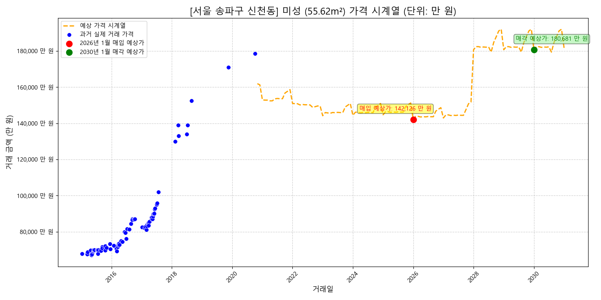
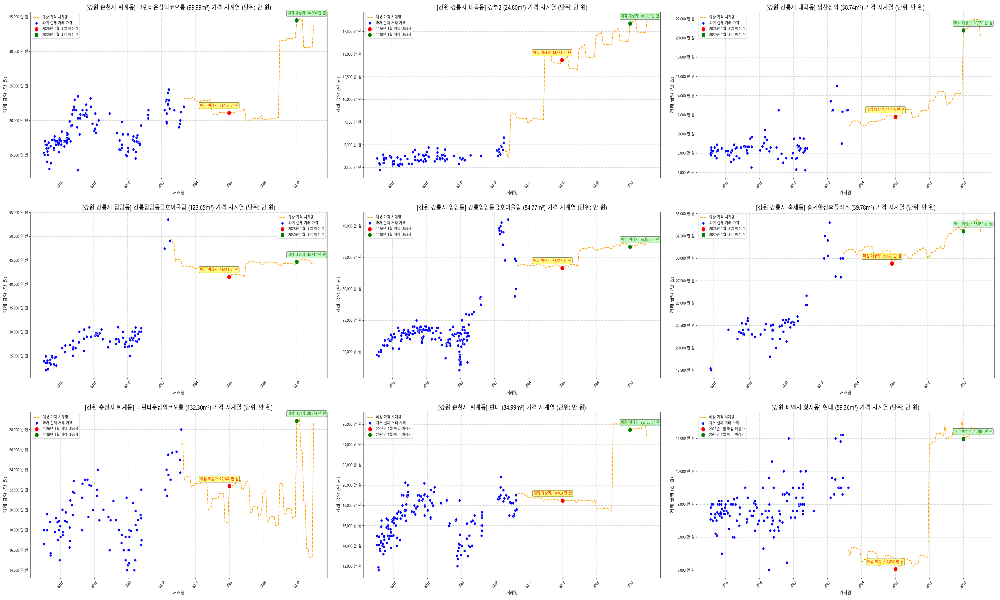


# 8. Lesson & Learn
- TDB
