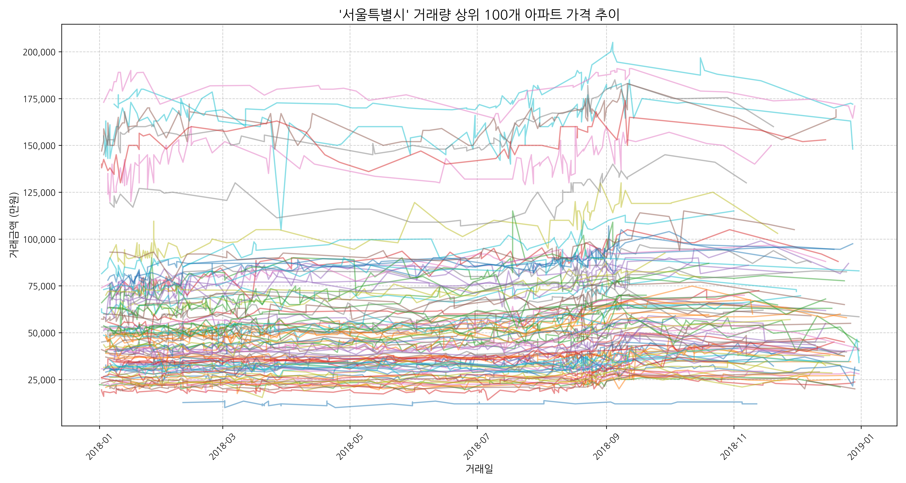

# Title
### 대한민국 아파트 실거래 데이터셋을 활용한 가격 예측 분석

# Member
- 이강훈 Kanghun Lee
- 우동훈 DongHun Woo
- 강종석 JongSeok Kang

# 1. Objective
- 대한민국 아파트 실거래 데이터셋을 활용한 가격 예측 분석

# 2. Dataset
- 'KoreaApartDeal.csv'  01/15/2015 ~ 04/30/2023 (425MB) from Kaggle
- 'LocationCode.csv' (3.8MB) from 공공데이터 

# 3. Pre-Processing
- Environment
    - python 3.11
    - pip install pandas matplotlib


- 'KoreaApartDeal.csv' Data는 지역코드와 법정동 Data만 존재하여, 시도명 및 시군구명 공공데이터 'LocationCode.csv' 를 이용하여 Human Readable Data 로 변경
- 아파트와 전용면적으로 UniqueID를 부여하여 Data Processing 부호화
  
[ Before ]
| 지역코드 | 법정동 | 거래일 | 아파트 | 지번 | 전용면적 | 층 | 건축년도 | 거래금액 |
| --- | --- | --- | --- | --- | --- | --- | --- | --- |
| 31110 | 학성동 | 5/30/2020 0:00 | 남운학성타운 | 379 | 135.58 | 8 | 1991 | 26700 |
| 31110 | 남외동 | 1/3/2020 0:00 | 남외푸르지오1차 | 506-1 | 101.6 | 2 | 2006 | 35500 |

[ After ]
| UniqueID | 시도명 | 시군구명 | 법정동 | 아파트 | 전용면적 | 거래일 | 거래금액 |
| --- | --- | --- | --- | --- | --- | --- | --- |
| 311101010000000136 | 울산광역시 | 중구 | 학성동 | 남운학성타운 | 135.58 | 2020-05-30 | 26700 |
| 311101150000001102 | 울산광역시 | 중구 | 남외동 | 남외푸르지오1차 | 101.6 | 2020-01-03 | 35500 |

```python
location_df_filtered = location_df[location_df['시군구명'].notna()].copy()
location_df_filtered['지역코드'] = location_df_filtered['법정동코드'].str[:5].astype(int)
loc_map = location_df_filtered[['지역코드', '시도명', '시군구명']].drop_duplicates()
df = pd.merge(deal_df, loc_map, on='지역코드', how='left')

loc_lookup = location_df[['시도명', '시군구명', '읍면동명', '리명', '법정동코드']].copy()
loc_lookup['법정동'] = (loc_lookup['읍면동명'].fillna('') + ' ' + loc_lookup['리명'].fillna('')).str.strip()
final_df = pd.merge(df, loc_lookup[['시도명', '시군구명', '법정동', '법정동코드']],
                    on=['시도명', '시군구명', '법정동'],
                    how='left')

unique_apart_count = final_df['아파트'].nunique()
final_df['아파트ID'] = pd.factorize(final_df['아파트'])[0]
final_df['아파트ID'] = final_df['아파트ID'].astype(str).str.zfill(5)
final_df['전용면적ID'] = final_df['전용면적'].round(0).astype(int).astype(str).str.zfill(3)
final_df['UniqueID'] = final_df['법정동코드'] + final_df['아파트ID'] + final_df['전용면적ID']
```


- Kaggle Data중 '거래일자'의 Date Format이 불규칙하여, 하나의 format으로 변경하여 data frame에 저장
- Kaggle Data중 '거래금액'의 Foramt이 불규칙하여, numeric으로 변경 할 수 있도록 string 변환

[ Before ]
| 지역코드 | 법정동 | 거래일 | 아파트 | 지번 | 전용면적 | 층 | 건축년도 | 거래금액 |
| --- | --- | --- | --- | --- | --- | --- | --- | --- |
| 31110 | 학성동 | 5/30/2020 0:00 | 남운학성타운 | 379 | 135.58 | 8 | 1991 | 26700 |
| 26380 | 다대동 | 2016-01-07 00:00:00 | 몰운대 | 1550 | 49.08 | 6 | 1996.0 | 9200 |
| 43112 | 개신동 | 2022-11-27 00:00:00 | 삼익2 | 11 | 84.96 | 11 | 1993 | 16,500 |

[ After ]
| UniqueID | 시도명 | 시군구명 | 법정동 | 아파트 | 전용면적 | 거래일 | 거래금액 |
| --- | --- | --- | --- | --- | --- | --- | --- |
| 311101010000000136 | 울산광역시 | 중구 | 학성동 | 남운학성타운 | 135.58 | 2020-05-30 | 26700 |
| 263801060021603049 | 부산광역시 | 사하구 | 다대동 | 몰운대 | 49.08 | 2018-03-01 | 10600 | 
| 431121090007429085 | 충청북도 | 청주시서원구 | 개신동 | 삼익2 | 84.96 | 2022-11-27 | 16500 |


```python
final_df['거래금액'] = pd.to_numeric(final_df['거래금액'].astype(str).str.replace(',', ''), errors='coerce')
final_df['거래일_정리'] = final_df['거래일'].astype(str).str.split(' ').str[0]
final_df['거래일_정리'] = pd.to_datetime(final_df['거래일_정리'], format='mixed', errors='coerce')
invalid_dates = final_df[final_df['거래일_정리'].isnull()]
final_df.dropna(subset=['거래일_정리'], inplace=True)
final_df['거래일'] = final_df['거래일_정리'].dt.date
final_df.drop(columns=['거래일_정리'], inplace=True)
```

# 4. Data Visialization
- 년도별 거래량 추이


```python
def save_transaction_plots_by_date(df, output_dir='preprocessed'):
    os.makedirs(output_dir, exist_ok=True)
    print("\n--- Starting to extract daily transaction counts ---")
    daily_transaction_counts = final_df['거래일'].value_counts()
    daily_transaction_counts_sorted = daily_transaction_counts.sort_index()

    plt.figure(figsize=(15, 7))
    daily_transaction_counts_sorted.plot(kind='line', color='royalblue')
    plt.title('거래일 별 거래 건수 추이', fontsize=16)
    plt.xlabel('거래일', fontsize=12)
    plt.ylabel('거래 건수', fontsize=12)
    plt.margins(x=0.01)
    plt.ylim(bottom=0)
    plt.grid(True, linestyle='--', alpha=0.6)
    plt.tight_layout()

    output_viz_path = os.path.join(output_dir, '거래일별_거래건수_추이.png')
    plt.savefig(output_viz_path, dpi=300)
    print(f"Trend chart has been saved to: '{output_viz_path}'")

    plt.close()
```

- 17개 광역시도 별 거래량 Top 100의 년도별 가격 추이



```python
def save_top100_plots_by_sido(df, output_dir='preprocessed'):
    os.makedirs(output_dir, exist_ok=True)
    print(f"transcation top 100 chart images are saved in '{output_dir}' folder.")

    sido_list = df['시도명'].unique()

    for sido in sido_list:
        print(f"\n'{sido}' chart is saving...")

        sido_df = df[df['시도명'] == sido].copy()

        if sido_df.empty:
            print(f"'{sido}' is empty. Skip!")
            continue

        transaction_counts = sido_df['UniqueID'].value_counts()
        top_100_ids = transaction_counts.head(100).index
        top_100_df = sido_df[sido_df['UniqueID'].isin(top_100_ids)]

        print(f"Graphing the top 100 apartment transactions out of a total of {len(transaction_counts):,} in the '{sido}' region.")

        plt.figure(figsize=(15, 8))
        ax = plt.gca()

        for unique_id in top_100_ids:
            target_df = top_100_df[top_100_df['UniqueID'] == unique_id].copy()
            if not target_df.empty:
                target_df.sort_values('거래일', inplace=True)
                ax.plot(target_df['거래일'], target_df['거래금액'], marker='', linestyle='-', alpha=0.5)

        plt.title(f"'{sido}' 거래량 상위 100개 아파트 가격 추이", fontsize=16)
        plt.xlabel("거래일", fontsize=12)
        plt.ylabel("거래금액 (만원)", fontsize=12)
        plt.ylim(bottom=0)
        ax.yaxis.set_major_formatter(mticker.FuncFormatter(lambda x, p: format(int(x), ',')))
        plt.margins(x=0.01)
        plt.xticks(rotation=45)
        plt.grid(True, linestyle='--', alpha=0.6)
        plt.tight_layout()

        safe_sido_name = "".join(c for c in sido if c.isalnum())
        filename = f"{safe_sido_name}_가격추이_상위100.png"
        filepath = os.path.join(output_dir, filename)

        plt.savefig(filepath, dpi=300)
        print(f"'{filepath}' file saved.")

        plt.close()
```

# 5. Analysis based on Theory
- xxx

# 6. Prediction
- xxx
- 
# 7. Conclusion
- xxx
