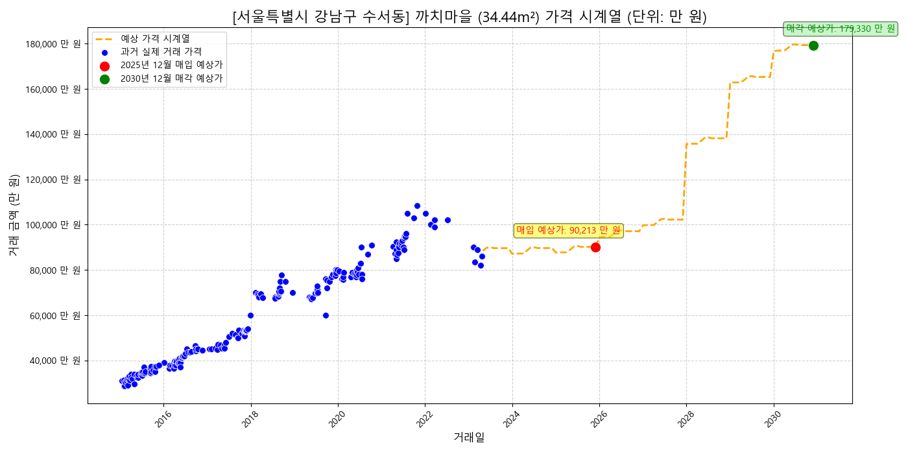
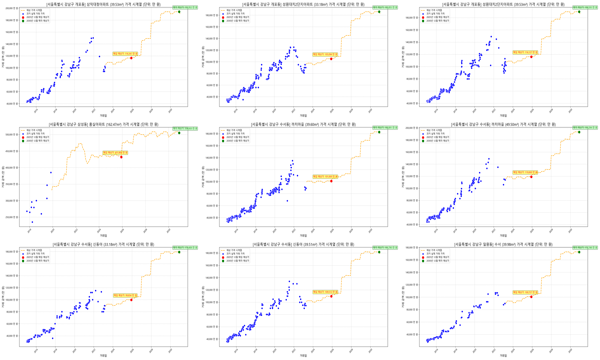

# Title
### 대한민국 아파트 실거래 데이터셋을 활용한 가격 예측 분석

# Member
- 이강훈 Kanghun Lee
- 우동훈 DongHun Woo
- 강종석 JongSeok Kang

# 1. Objective
- 대한민국 아파트 실거래 데이터셋을 머신러닝을 이용하여 학습시키고 매매 투자시 가장 큰 이익을 가져다 주는 아파트를 예측

# 2. Dataset
- 'KoreaApartDeal.csv'  01/15/2015 ~ 04/30/2023 (425MB) from Kaggle
- 'LocationCode.csv' (3.8MB) from 공공데이터 

# 3. Pre-Processing
- Environment
    - python 3.11
    - pip install pandas matplotlib


- 'KoreaApartDeal.csv' Data는 지역코드와 법정동 Data만 존재하여, 시도명 및 시군구명 공공데이터 'LocationCode.csv' 를 이용하여 Human Readable Data 로 변경
- 지역명과 아파트, 전용면적으로 UniqueID로 고유값을 생성하여 Data Processing 및 시각화에 용의하도록 개선
  
[ Kaggle 원본 데이터 : 시도 이름 없어 데이터 분류 어려움 ]
| 지역코드 | 법정동 | 거래일 | 아파트 | 지번 | 전용면적 | 층 | 건축년도 | 거래금액 |
| --- | --- | --- | --- | --- | --- | --- | --- | --- |
| 31110 | 학성동 | 5/30/2020 0:00 | 남운학성타운 | 379 | 135.58 | 8 | 1991 | 26700 |
| 31110 | 남외동 | 1/3/2020 0:00 | 남외푸르지오1차 | 506-1 | 101.6 | 2 | 2006 | 35500 |

[ 지역코드 공공데이터와 merge하여 시도 및 시군구명 추가 ]
| UniqueID | 시도명 | 시군구명 | 법정동 | 아파트 | 전용면적 | 거래일 | 거래금액 |
| --- | --- | --- | --- | --- | --- | --- | --- |
| 311101010000000136 | 울산광역시 | 중구 | 학성동 | 남운학성타운 | 135.58 | 2020-05-30 | 26700 |
| 311101150000001102 | 울산광역시 | 중구 | 남외동 | 남외푸르지오1차 | 101.6 | 2020-01-03 | 35500 |

```python
location_df_filtered = location_df[location_df['시군구명'].notna()].copy()
location_df_filtered['지역코드'] = location_df_filtered['법정동코드'].str[:5].astype(int)
loc_map = location_df_filtered[['지역코드', '시도명', '시군구명']].drop_duplicates()
df = pd.merge(deal_df, loc_map, on='지역코드', how='left')

loc_lookup = location_df[['시도명', '시군구명', '읍면동명', '리명', '법정동코드']].copy()
loc_lookup['법정동'] = (loc_lookup['읍면동명'].fillna('') + ' ' + loc_lookup['리명'].fillna('')).str.strip()
final_df = pd.merge(df, loc_lookup[['시도명', '시군구명', '법정동', '법정동코드']],
                    on=['시도명', '시군구명', '법정동'],
                    how='left')

unique_apart_count = final_df['아파트'].nunique()
final_df['아파트ID'] = pd.factorize(final_df['아파트'])[0]
final_df['아파트ID'] = final_df['아파트ID'].astype(str).str.zfill(5)
final_df['전용면적ID'] = final_df['전용면적'].round(0).astype(int).astype(str).str.zfill(3)
final_df['UniqueID'] = final_df['법정동코드'] + final_df['아파트ID'] + final_df['전용면적ID']
```


- Kaggle Data중 '거래일자'의 Date Format이 불규칙하여, 하나의 format으로 변경하여 data frame에 저장
- Kaggle Data중 '거래금액'의 Foramt이 불규칙하여, numeric으로 변경 할 수 있도록 string 변환

[ format 이 일정치 않는 거래일과 거래금액 ]
| UniqueID | 시도명 | 시군구명 | 법정동 | 아파트 | 전용면적 | 거래일 | 거래금액 |
| --- | --- | --- | --- | --- | --- | --- | --- |
| 311101010000000136 | 울산광역시 | 중구 | 학성동 | 남운학성타운 | 135.58 | 5/30/2020 0:00 | 26700 |
| 263801060021603049 | 부산광역시 | 사하구 | 다대동 | 몰운대 | 49.08 | 2016-01-07 00:00:00 | 10600 | 
| 431121090007429085 | 충청북도 | 청주시서원구 | 개신동 | 삼익2 | 84.96 | 2022-11-27 00:00:00 | 16,500 |


[ 표준 format으로 변경 및 결측 데이터 삭제]
| UniqueID | 시도명 | 시군구명 | 법정동 | 아파트 | 전용면적 | 거래일 | 거래금액 |
| --- | --- | --- | --- | --- | --- | --- | --- |
| 311101010000000136 | 울산광역시 | 중구 | 학성동 | 남운학성타운 | 135.58 | 2020-05-30 | 26700 |
| 263801060021603049 | 부산광역시 | 사하구 | 다대동 | 몰운대 | 49.08 | 2018-03-01 | 10600 | 
| 431121090007429085 | 충청북도 | 청주시서원구 | 개신동 | 삼익2 | 84.96 | 2022-11-27 | 16500 |


```python
final_df['거래금액'] = pd.to_numeric(final_df['거래금액'].astype(str).str.replace(',', ''), errors='coerce')
final_df['거래일_정리'] = final_df['거래일'].astype(str).str.split(' ').str[0]
final_df['거래일_정리'] = pd.to_datetime(final_df['거래일_정리'], format='mixed', errors='coerce')
invalid_dates = final_df[final_df['거래일_정리'].isnull()]
final_df.dropna(subset=['거래일_정리'], inplace=True)
final_df['거래일'] = final_df['거래일_정리'].dt.date
final_df.drop(columns=['거래일_정리'], inplace=True)
```

# 4. Data Visialization
- 년도별 거래량 추이


```python
def save_transaction_plots_by_date(df, output_dir='preprocessed'):
    os.makedirs(output_dir, exist_ok=True)
    print("\n--- Starting to extract daily transaction counts ---")
    daily_transaction_counts = final_df['거래일'].value_counts()
    daily_transaction_counts_sorted = daily_transaction_counts.sort_index()

    plt.figure(figsize=(15, 7))
    daily_transaction_counts_sorted.plot(kind='line', color='royalblue')
    plt.title('거래일 별 거래 건수 추이', fontsize=16)
    plt.xlabel('거래일', fontsize=12)
    plt.ylabel('거래 건수', fontsize=12)
    plt.margins(x=0.01)
    plt.ylim(bottom=0)
    plt.grid(True, linestyle='--', alpha=0.6)
    plt.tight_layout()

    output_viz_path = os.path.join(output_dir, '거래일별_거래건수_추이.png')
    plt.savefig(output_viz_path, dpi=300)
    print(f"Trend chart has been saved to: '{output_viz_path}'")

    plt.close()
```

- 17개 광역시도 별 거래량 Top 100의 년도별 가격 추이


```python
def save_top100_plots_by_sido(df, output_dir='preprocessed'):
    os.makedirs(output_dir, exist_ok=True)
    print(f"transcation top 100 chart images are saved in '{output_dir}' folder.")

    sido_list = df['시도명'].unique()

    for sido in sido_list:
        print(f"\n'{sido}' chart is saving...")

        sido_df = df[df['시도명'] == sido].copy()

        if sido_df.empty:
            print(f"'{sido}' is empty. Skip!")
            continue

        transaction_counts = sido_df['UniqueID'].value_counts()
        top_100_ids = transaction_counts.head(100).index
        top_100_df = sido_df[sido_df['UniqueID'].isin(top_100_ids)]

        print(f"Graphing the top 100 apartment transactions out of a total of {len(transaction_counts):,} in the '{sido}' region.")

        plt.figure(figsize=(15, 8))
        ax = plt.gca()

        for unique_id in top_100_ids:
            target_df = top_100_df[top_100_df['UniqueID'] == unique_id].copy()
            if not target_df.empty:
                target_df.sort_values('거래일', inplace=True)
                ax.plot(target_df['거래일'], target_df['거래금액'], marker='', linestyle='-', alpha=0.5)

        plt.title(f"'{sido}' 거래량 상위 100개 아파트 가격 추이", fontsize=16)
        plt.xlabel("거래일", fontsize=12)
        plt.ylabel("거래금액 (만원)", fontsize=12)
        plt.ylim(bottom=0)
        ax.yaxis.set_major_formatter(mticker.FuncFormatter(lambda x, p: format(int(x), ',')))
        plt.margins(x=0.01)
        plt.xticks(rotation=45)
        plt.grid(True, linestyle='--', alpha=0.6)
        plt.tight_layout()

        safe_sido_name = "".join(c for c in sido if c.isalnum())
        filename = f"{safe_sido_name}_가격추이_상위100.png"
        filepath = os.path.join(output_dir, filename)

        plt.savefig(filepath, dpi=300)
        print(f"'{filepath}' file saved.")

        plt.close()
```

# 5. Analysis based on Theory
- XGBoost Algorithm 적용
> https://www.ibm.com/kr-ko/think/topics/xgboost
>> XGBoost란 무엇인가요?
>>> XGBoost(eXtreme Gradient Boosting)는 경사하강법을 활용하는 지도 학습 부스팅 알고리즘인 그레이디언트 부스트 Decision Trees를 사용하는 분산형 오픈 소스 머신 러닝 라이브러리입니다. 속도, 효율성, 대규모 데이터 세트에 대한 확장성이 뛰어난 것으로 잘 알려져 있습니다.
>>> 워싱턴 대학교의 티안치 첸(Tianqi Chen)이 개발한 XGBoost는 동일한 일반 프레임워크를 사용하여 그레이디언트 부스팅을 고급으로 구현한 것입니다. 즉, 잔차를 더하여 약한 학습기 트리를 강한 학습기로 결합합니다. 이 라이브러리는 C++, Python, R, Java, Scala 및 Julia에서 사용할 수 있습니다.1

>>> Decision Trees와 부스팅 비교
>>> Decision Trees는 머신 러닝에서 분류 또는 회귀 작업에 사용됩니다. 내부 노드는 기능을, 분기는 의사 결정 규칙을, 각 리프 노드는 데이터 세트의 결과를 나타내는 계층적 트리 구조를 사용합니다.
>>> Decision Trees는 과적합되기 쉽기 때문에 부스팅과 같은 앙상블 방법을 사용하여 더 견고한 모델을 만들 수 있습니다. 부스팅은 여러 개의 개별 약한 트리, 즉 무작위 확률보다 약간 더 나은 성능을 보이는 모델을 결합하여 강한 학습기를 형성합니다. 각 약한 학습기는 이전 모델에서 발생한 오류를 수정하기 위해 순차적으로 학습합니다. 수백 번의 반복 후 약한 학습기는 강한 학습기로 변환됩니다.
>>> 랜덤 포레스트와 부스팅 알고리즘은 모두 개별 학습기 트리를 사용하여 예측 성능을 향상하는 인기 있는 앙상블 학습 기법입니다. 랜덤 포레스트는 배깅(부트스트랩 집계) 개념을 기반으로 하며 각 트리를 독립적으로 학습시켜 예측을 결합하지만, 부스팅 알고리즘은 약한 학습기가 순차적으로 학습되어 이전 모델의 실수를 수정하는 가산적 접근 방식을 사용합니다.

- Data Load

 PreProcessed Data를 Load 하고, 거래 횟수가 너무 적은 아파트의 Data는 Train시 부정확성을 높일 우려가 있어, 사전 제거
```python
MIN_TRANSACTION_COUNT = 10  # 최소 거래 횟수 필터링 기준
apt_counts = df['UniqueID'].value_counts()
valid_uids = apt_counts[apt_counts >= MIN_TRANSACTION_COUNT].index
df = df[df['UniqueID'].isin(valid_uids)].copy()
print(f"최소 {MIN_TRANSACTION_COUNT}회 이상 거래된 아파트로 필터링 후, 남은 거래 기록: {len(df)}개")
```

- XGBoost 입력 전 시도명 등 String 형식의 Data를 LabelEncoder를 통하여 정수형으로 변경
```python
cat_features = ['시도명', '시군구명', '법정동', '아파트']
label_encoders = {}
for col in cat_features:
    df[col] = df[col].astype(str).fillna('missing')
    le = LabelEncoder()
    df[col] = le.fit_transform(df[col])
    label_encoders[col] = le
```

- XGBoost 입력
```python
# 인코딩된 데이터를 X에 할당
X = df[features]
y = df[target]

features = ['시도명', '시군구명', '법정동', '아파트', '전용면적',
            '건축년도', '거래_년', '거래_월', '건축_경과년수', '최근_거래일_점수']
target = '거래금액'
X_train, X_test, y_train, y_test = train_test_split(X, y, test_size=0.2, random_state=42)
xgb_model = XGBRegressor(
    n_estimators=1000,
    learning_rate=0.05,
    max_depth=6,
    random_state=42,
    n_jobs=-1
)
xgb_model.fit(X_train, y_train)
```

- XGBoost용 preload data 및 trained data를 file로 저장하여, 매번 load를 하지않고 prediction시 Quick하게 수행
```python
if not SHOULD_RETRAIN:
    # XGBoost용 preload data 및 trained data file을 읽기
    dtype_spec_loaded = {col: 'int' for col in ['시도명', '시군구명', '법정동', '아파트']}
    df = pd.read_csv(PRELOAD_FILE_PATH, dtype=dtype_spec_loaded)
    xgb_model = joblib.load(MODEL_FILE_PATH)

# Snip... XBoost 수행 ...

# XGBoost용 preload data 및 trained data를 file로 저장하여
df.to_csv(PRELOAD_FILE_PATH, index=False, encoding='utf-8')
joblib.dump(xgb_model, MODEL_FILE_PATH)
```

# 6. Prediction
- 매입 시점은 2025년 12월,  매각 시점은 2030년 12월로 임의 고정 (간단하게 입력 방식으로도 변경 가능)
- 매입 시점과 매각 시점의 가격을 XGBoost로 Prediction
```python
base_cols = ['UniqueID', '시도명', '시군구명', '법정동', '아파트', '전용면적', '건축년도']
buy_X = all_unique_apts[base_cols].copy()
buy_X['거래_년'] = predict_date_2025.year
buy_X['거래_월'] = predict_date_2025.month
buy_X['건축_경과년수'] = buy_X['거래_년'] - buy_X['건축년도']
buy_X['최근_거래일_점수'] = (predict_date_2025 - base_deal_date).days

sell_X = all_unique_apts[base_cols].copy()
sell_X['거래_년'] = predict_date_2030.year
sell_X['거래_월'] = predict_date_2030.month
sell_X['건축_경과년수'] = sell_X['거래_년'] - sell_X['건축년도']
sell_X['최근_거래일_점수'] = (predict_date_2030 - base_deal_date).days

buy_X_model = buy_X[features]
sell_X_model = sell_X[features]

print("\n모델 예측 수행 시작 (전국)...")
buy_prices_2025 = xgb_model.predict(buy_X_model)
sell_prices_2030 = xgb_model.predict(sell_X_model)
```

- XGBoost로 Prediction된 매각 시점 가격과 매입시점 가격의 차이을 가지고 dataframe 생성
```python
reco_df = all_unique_apts[['UniqueID', '시도명', '시군구명', '법정동', '아파트', '전용면적', '건축년도']].copy()
reco_df['매입예상가_2025_12'] = buy_prices_2025.astype(int)
reco_df['매각예상가_2030_12'] = sell_prices_2030.astype(int)
reco_df['예상_최대이익'] = reco_df['매각예상가_2030_12'] - reco_df['매입예상가_2025_12']

for col in cat_features:
    reco_df[col] = label_encoders[col].inverse_transform(reco_df[col].astype(int))

reco_df = reco_df.sort_values(by='예상_최대이익', ascending=False).reset_index(drop=True)

sido_list = sorted(reco_df['시도명'].unique())
sido_map = {i + 1: sido for i, sido in enumerate(sido_list)}
```

# 7. Result
- 시도별로 원하는 지역을 입력 받아 10개의 아파트 추천 list를 출력
```
==================================================
지역 선택: 예측 결과를 볼 **시도명**을 선택해주세요.
0: 프로그램 종료
==================================================
1: 강원도
2: 경기도
3: 경상남도
4: 경상북도
5: 광주광역시
6: 대구광역시
7: 대전광역시
8: 부산광역시
9: 서울특별시
10: 세종특별자치시
11: 울산광역시
12: 인천광역시
13: 전라남도
14: 전라북도
15: 제주특별자치도
16: 충청남도
17: 충청북도
==================================================
번호를 입력하세요 (0 입력 시 종료): 9

======================================================================
서울특별시 최대 이익 아파트 추천 결과 (단위: 만 원)
======================================================================
**최적 아파트:** 까치마을 (강남구 수서동)
**전용면적:** 34.44 m²
**2025년 12월 예상 매입가:** 90,213 만 원
**2030년 12월 예상 매각가:** 179,330 만 원
**예상 최대 이익 (5년):** 89,117 만 원
======================================================================

상위 10개 추천 아파트 목록 (서울특별시, 이익 만 원 기준)
```
| 시도명 | 시군구명 | 법정동 | 아파트 | 전용면적 | 예상_최대이익 | 매입예상가_2025_12 | 매각예상가_2030_12 | 
| --- | --- | --- | --- | --- | --- | --- | --- |
| 서울특별시 | 강남구 | 수서동 | 까치마을 | 34.44 | 89,117 | 90,213 | 179,330 |
| 서울특별시 | 강남구 | 수서동 | 까치마을 | 39.60 | 81,822 | 101,069 | 182,891 |
| 서울특별시 | 강남구 | 개포동 | 성원대치2단지아파트 | 33.18 | 80,761 | 105,094 | 185,855 |
| 서울특별시 | 강남구 | 수서동 | 신동아 | 33.18 | 79,574 | 99,834 | 179,408 |
| 서울특별시 | 강남구 | 개포동 | 삼익대청아파트 | 39.53 | 77,611 | 116,341 | 193,952 |
| 서울특별시 | 강남구 | 수서동 | 까치마을 | 49.50 | 74,225 | 119,069 | 193,294 |
| 서울특별시 | 강남구 | 개포동 | 성원대치2단지아파트 | 39.53 | 73,466 | 116,127 | 189,593 |
| 서울특별시 | 강남구 | 수서동 | 신동아 | 39.51 | 72,278 | 109,512 | 181,790 |
| 서울특별시 | 강남구 | 일원동 | 수서 | 39.98 | 72,021 | 100,727 | 172,748 |






# 8. Lesson & Learn
- TDB
